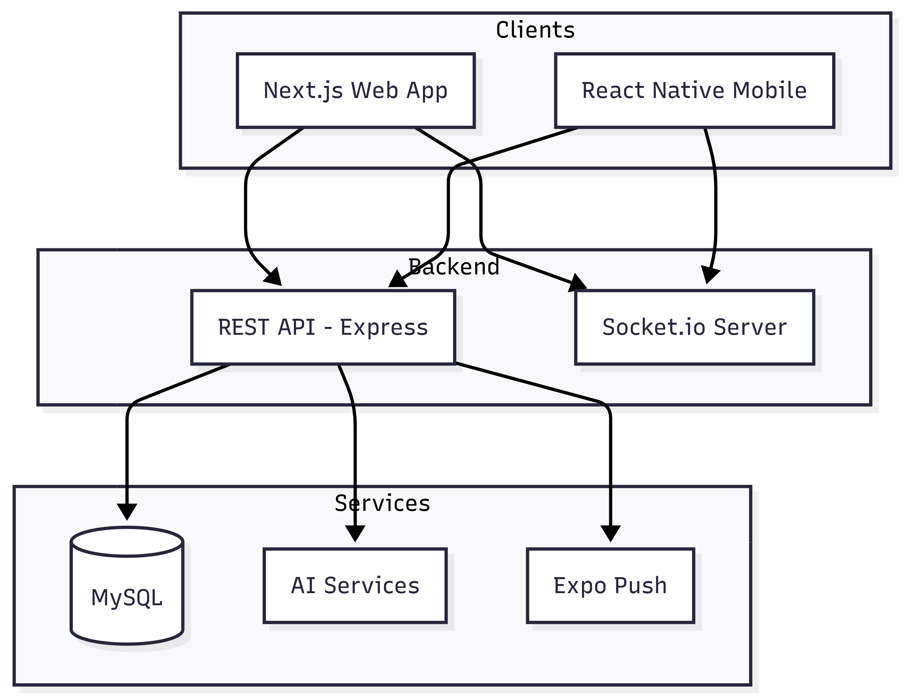
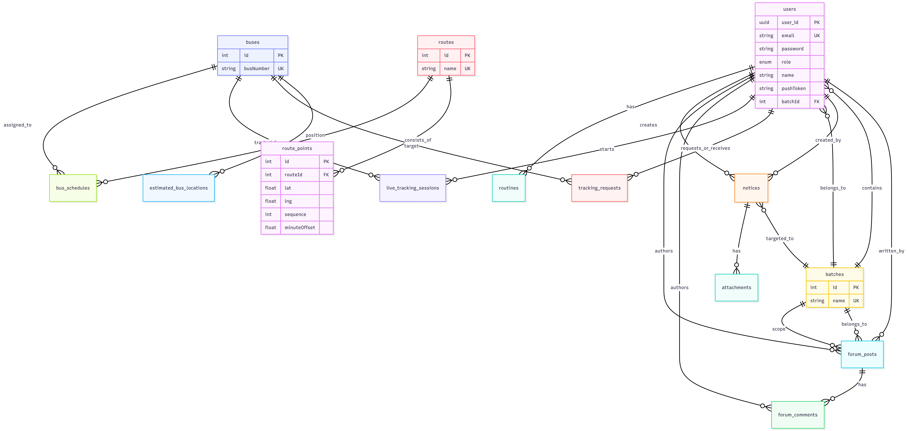
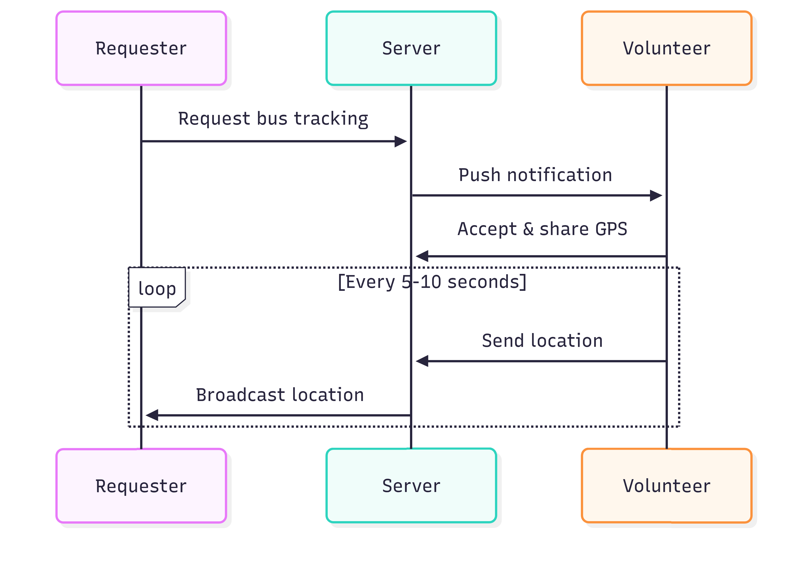

# TrackU - University Bus Tracking and Management System

A comprehensive university transportation management platform with real-time bus tracking, notice management, academic calendar, student forum, and class routine management. The system includes a backend API, web frontend, and React Native mobile application.

## Architecture Overview

The project consists of three main components:

- **Backend**: Express.js REST API with TypeORM, Socket.io for real-time features
- **Frontend**: Next.js web application with shadcn/ui components
- **Mobile**: Expo React Native application for iOS and Android

## System Architecture

<div align="center">
  
  
  *Fig 01: System Architecture Overview*
</div>

## Technology Stack

### Backend
- Node.js / Express.js
- TypeScript
- TypeORM with MySQL
- Socket.io for real-time communication
- JWT authentication
- Multer for file uploads
- Nodemailer for email services
- Expo Server SDK for push notifications
- AI integration (OpenRouter, Groq, Ollama) for routine image analysis

### Frontend
- Next.js 16
- React 19
- TypeScript
- Tailwind CSS
- shadcn/ui components
- MapLibre GL for maps
- Socket.io client
- React Hook Form with Zod validation

### Mobile
- Expo SDK 54
- React Native 0.81
- TypeScript
- NativeWind (Tailwind for React Native)
- MapLibre React Native
- Zustand for state management
- Expo Notifications for push notifications
- Expo Location for GPS tracking
- Expo Calendar for calendar integration

## Project Structure

```
tracku/
├── backend/                 # Express backend server
│   ├── src/
│   │   ├── app/
│   │   │   ├── config/     # Configuration and environment
│   │   │   ├── db/         # Database connection
│   │   │   ├── errors/     # Error handling
│   │   │   ├── middlewares/# Auth, role validation, uploads
│   │   │   ├── modules/    # Feature modules
│   │   │   ├── routes/     # API route aggregation
│   │   │   └── utils/      # Helper functions
│   │   ├── app.ts          # Express app setup
│   │   └── server.ts       # Server entry point
│   ├── package.json
│   └── tsconfig.json
│
├── frontend/               # Next.js web application
│   ├── src/
│   │   ├── app/            # Next.js app router pages
│   │   │   ├── (auth)/     # Login/register pages
│   │   │   └── (commonLayout)/ # Main app layout
│   │   ├── components/     # React components
│   │   │   ├── ui/         # shadcn/ui components
│   │   │   └── module/     # Feature-specific components
│   │   ├── hooks/          # Custom React hooks
│   │   ├── lib/            # Utilities and API actions
│   │   └── types/          # TypeScript definitions
│   ├── package.json
│   └── next.config.ts
│
├── mobile/                 # Expo React Native app
│   ├── app/               # Expo router pages
│   │   ├── (auth)/        # Authentication screens
│   │   └── (tabs)/        # Main tab navigation
│   ├── components/        # React Native components
│   ├── lib/               # API client and utilities
│   ├── store/             # Zustand stores
│   └── package.json
│
└── README.md
```

## Core Features

### User Management
- Role-based access control (Admin, Teacher, Student, CR)
- User registration and authentication with JWT
- Profile management
- Batch assignment for students and CRs
- Bulk user import via Excel

### Bus Tracking
- Real-time bus location tracking via GPS
- Live bus location sharing
- Socket-based location updates
- Proximity-based tracking requests
- Route visualization on map
- Estimated bus position calculation based on schedule
- One-time tracking request system with expiration

### Notices
- Create, approve, and manage notices
- Audience targeting (all users, teachers, specific batch)
- Status workflow (pending → approved/rejected)
- Tagging system (general, academic, exam, event, transport, urgent)
- File attachments
- Calendar integration for event notices

### Academic Routine
- AI-powered routine extraction from images
- Support for multiple AI providers (OpenRouter, Groq, Ollama)
- Weekly class schedule management
- Reminder notifications for upcoming classes
- Sync to device calendar
- Confidence scoring for extracted data

### Calendar
- Aggregated calendar view of notices, routines, and personal events
- Create personal and public events
- Notices with event dates appear automatically
- Routine classes appear as recurring events
- Reminder notifications (10 minutes before events)
- Sync to device calendar

### Forum
- Batch-wise discussion forum
- CRUD operations for posts and comments
- Search functionality
- Role-based access (students and CRs only)

### Push Notifications
- Expo push notifications for:
  - New notices
  - Class reminders
  - Event reminders
  - Tracking requests
- Local notification fallback
- Background location updates for volunteer tracking

## API Endpoints

| Module | Endpoint | Methods | Description |
|--------|----------|---------|-------------|
| Auth | `/auth` | POST, GET | Login, register, forgot password, socket token |
| User | `/user` | GET, POST, PATCH, DELETE | User CRUD, profile, bulk upload, push token |
| Bus | `/bus` | GET, POST, PATCH, DELETE | Bus management |
| Route | `/route` | GET, POST, PUT, DELETE | Route and route points management |
| Schedule | `/schedule` | GET, POST, PATCH, DELETE | Bus schedule management |
| Notice | `/notice` | GET, POST, PUT, DELETE | Notice CRUD, approval workflow |
| Tracking | `/tracking` | GET, POST, PATCH | Tracking requests and responses |
| Location | `/location` | POST | User location updates |
| Routine | `/routine` | GET, POST, PATCH, DELETE | Routine upload, analysis, management |
| Calendar | `/calendar` | GET, POST, PUT, DELETE | Calendar events and fixtures |
| Forum | `/forum` | GET, POST, PUT, DELETE | Forum posts and comments |
| Attachment | `/attachment` | GET, POST, DELETE | File attachments for notices |

<div align="center">
  
  
  *Fig 02: ER Diagram*
</div>


Key entities (TypeORM):

- **User**: Authentication, roles, batch reference, push token
- **Batch**: Academic batch groups (2021, 2022, etc.)
- **Bus**: Bus identification
- **Route**: Route metadata with RoutePoints (lat/lng, sequence, minute offset)
- **BusSchedule**: Bus to route assignment with start/end times
- **Notice**: Title, content, status, audience targeting, event date/time
- **Routine**: Weekly class schedule per user
- **TrackingRequest**: Real-time location sharing requests
- **LiveTrackingSession**: Active GPS sharing sessions
- **ForumPost/ForumComment**: Student discussion forum
- **UserLocation**: Last known user location

## Environment Variables

### Backend (.env)
```env
PORT=5000
JWT_SECRET=your_jwt_secret
JWT_EXPIRES=7d
BCRYPT_SALT=10

MYSQL_HOST=localhost
MYSQL_PORT=3306
MYSQL_USER=root
MYSQL_PASSWORD=your_password
MYSQL_DB=tracku_db

# AI Services (optional)
OPENROUTER_API_KEY=your_key
GROQ_API_KEY=your_key
OLLAMA_URL=http://localhost:11434/api/generate

# Email (optional)
SMTP_HOST=smtp.gmail.com
SMTP_PORT=587
SMTP_USER=your_email
SMTP_PASS=your_password
SMTP_FROM=noreply@tracku.com

# Push notifications (optional)
EXPO_ACCESS_TOKEN=your_token
```

### Frontend (.env.local)
```env
JWT_SECRET=your_jwt_secret
BACKEND_BASE_URL=http://localhost:5000
```

### Mobile (.env)
```env
API_BASE_URL=http://192.168.x.x:5000/api/v1
SOCKET_URL=http://192.168.x.x:5000
```

## Installation

### Backend
```bash
cd backend
npm install
npm run dev
```

### Frontend
```bash
cd frontend
npm install
npm run dev
```

### Mobile
```bash
cd mobile
npm install
npx expo start
```

## Key Implementation Details

### Bus Location Estimation
When no user is actively tracking a bus, the system calculates estimated position using:
- Route points with minute offsets from schedule start
- Current time relative to bus schedule
- Linear interpolation between route points

### Real-time Tracking Flow
1. User requests tracking → System finds nearby users
2. Push notification sent to potential volunteers
3. Volunteer accepts → GPS sharing begins
4. Location updates broadcast to requester via Socket.io
5. Session expires when bus schedule ends
<div align="center">
  
  
  *Fig 03: Bus Tracking Flow*
</div>


### Routine AI Analysis
- Supports multiple AI providers for redundancy
- Extracts class times from timetable images
- Converts 12-hour format to 24-hour
- Returns confidence scores for each extracted slot
- User can edit before confirming

### Calendar Integration
- Aggregates three event types: notices (with event dates), routines, user fixtures
- Role-based visibility for notices
- Reminder notifications generated server-side
- Mobile app can sync to native calendar

## Testing

```bash
# Backend tests
cd backend
npm test

# Frontend tests
cd frontend
npm test

# Mobile tests
cd mobile
npm test
```

## Deployment

### Backend
- Configured for Vercel deployment (vercel.json)
- Requires MySQL database (planetscale, AWS RDS, etc.)
- Environment variables must be configured

### Frontend
- Deploy to Vercel
- Configure rewrites to backend API
- Set environment variables

### Mobile
- Build with EAS (eas.json configured)
- iOS App Store and Google Play distribution

## Security Features

- JWT authentication with HTTP-only cookies
- Role-based middleware for route protection
- Password hashing with bcrypt
- CORS configuration
- Input validation with Zod
- File upload restrictions (type and size limits)

## Real-time Features

- Socket.io for live bus locations
- Real-time notice publication
- Live tracking request/response
- GPS location streaming for volunteers